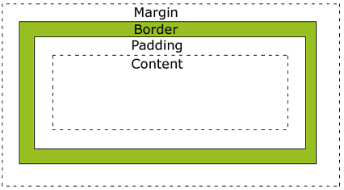

## 1.盒模型(box model)

所有HTML元素都可以看作盒子。它包括：margin(外边距)、border(边框)、padding(内边距)、content(内容)。



根据 W3C 的规范，元素的width、height属性只包含content，不包括padding和border。

IE浏览器有自己的标准，元素的width、height属性，指的是content + padding + border。

## 2.常用的CSS选择器

标签选择器、ID选择器、类选择器、后代选择器、子元素选择器、相邻兄弟选择器、通用选择器等。

## 3.CSS的权重

css的权重指在样式冲突时，某一条样式被应用的优先级。

`!important > 行内样式 > ID选择器 > 类选择器、属性选择器和伪类选择器 > 标签选择器和伪元素选择器`

## 4.如何隐藏一个元素

①display:none。这样元素在页面上不会占用任何空间，同时也不会对其他元素产生影响。

②visibility:hidden。这样元素在页面上不可见，但仍然占用空间。

③将元素的position属性设置为absolute或fixed，然后将元素移动到屏幕外或者使其超出容器的范围之外，这样元素在页面上不可见，但仍然占用空间。

## 5.Flex布局

Flex是Flexible Box的缩写，意为弹性布局，用来为盒状模型提供最大的灵活性。

任何一个容器都可以指定为 Flex 布局。

```css
.box{
  display: flex;
} 
```

行内元素也可以使用 Flex 布局。

```
.box{
  display: inline-flex;
}
```

 Webkit 内核的浏览器，必须加上`-webkit`前缀。

```
.box{
  display: -webkit-flex; /* Safari */
  display: flex;
}
```

**注意**，设为 Flex 布局以后，子元素的`float`、`clear`和`vertical-align`属性将失效。

采用Flex布局的元素，称为**Flex容器**（flex container），它的所有子元素自动成为容器成员，成为**Flex项目**（flex item）。


容器默认存在两根轴，水平的**主轴**（main axis）和垂直的**交叉轴**（cross axis）。


### 参考资料

《阮一峰的网络日志》
